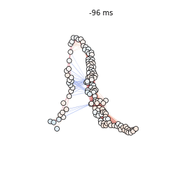
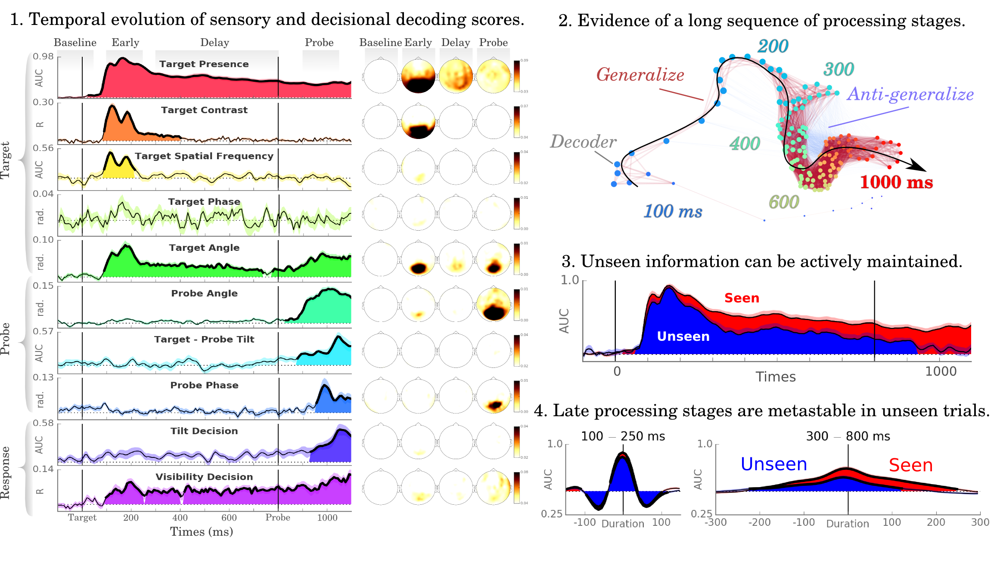

Selective maintenance of seen and unseen sensory features in the human brain
============================================================================

This repository stores all scripts to analyze MEG data from the unconscious orientations decoding project, led by Jean-Remi King, Niccolo Pescetelli & Stanislas Dehaene at Neurospin, CEA, Gif / Yvette, France.

The corresponding manuscript has been submitted and is currently not peer-reviewed. The pdf can be downloaded [here](TODO)

Detailed Abstract
=================

The current neuronal models of visual awareness postulate that a stimulus becomes consciously perceptible by maintaining and sharing information across the cortex via recurrent processing [1] and/or fronto-parietal feedback [2]. Identifying neuronal mechanisms that maintain and broadcast an invisible stimulus is therefore critical to test these models.

In the present study, we test models of consciousness through the use of multivariate decoding of dynamic magnetoencephalography (MEG) signals. We designed decoders that can extract, from MEG signals, the time course of the brain representations of many different variables. Those decoders attained an unprecedented level of sensitivity, allowing to track, over time, the temporal unfolding of the cerebral codes for all features of a subjectively invisible visual gabor patch (orientation, frequency, phase, etc). This advance allows us to show how different types of maintenance mechanisms can be qualitatively distinguished, and we demonstrate that unseen stimuli can be encoded, broadcasted and partially maintained by a long sequence of neural assemblies.

Specifically, we first show that, while a rich set of sensory features is encoded around 150 ms after stimulus onset, only the features relevant to the task are maintained during the retention period (Fig. 1: the red, green and purple decoding curves depict the task-relevant features).

We then demonstrate with temporal generalization analyses that this selective maintenance mechanism is performed by a long sequence of neuronal assemblies (Fig. 2. Each node depicts an empirically identified neural assembly), whose latest processing stages can maintain a coding activity for several hundreds of milliseconds. Critically, we show that unseen stimuli generate weak representations that are nevertheless i) broadcasted to all processing stages of this distributed network and ii) maintained by the latest processing stages (Fig. 3-4).
The present study suggests that the visibility of a stimulus depends on the neural representation of late processing stages rather than on the ability to maintain a stimulus, and therefore calls for a partial revision of the current neuronal models of visual awareness.

[1] Lamme, V., & Pieter R. "The distinct modes of vision offered by feedforward and recurrent processing." Trends in neurosciences 23.11 (2000): 571-579.

[2] Dehaene, S., et al. "Conscious, preconscious, and subliminal processing: a testable taxonomy." Trends in cognitive sciences 10.5 (2006): 204-211.

Tutorials
=========

The methods and some of the results can be interactively tested online through step-by-step tutorials via [Binder](http://mybinder.org/).

Click on the link to interactively test the tutorial online (no download or installation required).

* [`method_decoding.ipynb`](http://mybinder.org/repo/kingjr/decoding_unconscious_maintenance/tree/notebook/method_decoding.ipynb) explains the general procedure used to perform decoding with MEG data.
* [`method_model_types.py.ipynb`](http://mybinder.org/repo/kingjr/decoding_unconscious_maintenance/tree/notebook/method_model_types.py.ipynb) explains how categorical, ordinal and circular models can be fitted and scored.
* [`method_statistics.ipynb`](http://mybinder.org/repo/kingjr/decoding_unconscious_maintenance/tree/notebook/method_statistics.ipynb) explains how the statistics are performed in the manuscript.
* [`results_summary.ipynb`](http://mybinder.org/repo/kingjr/decoding_unconscious_maintenance/tree/notebook/results_summary.ipynb) gives a preview of some of the results to allow user to replicate our analyses, or go further by looking at individual subjects, test other statistical methods etc.

Also consider looking at the [MNE-Python gallery](http://martinos.org/mne/dev/auto_examples/). You will find several examples, showing how the `TimeDecoding` and `GeneralizationAcrossTime` can be used.

Scripts
=======

Overall, the scripts remain designed for research purposes, and could therefore be improved and clarified. If you judge that some codes would benefit from specific clarifications do not hesitate to raise an issue.

The scripts are generally decomposed in terms of general functions (base), actual analyses (decoding, cluster analyses), and report (plotting, tables, quick stats).

- `conditions.py` defines the analyses at a high level: how are the contrasts defined (e.g. decoding of the presence, phase etc), which conditions to include and exclude, what statistical pipeline to use depending (circular, linear, categorical) etc.

- `config.py` defines the data handling: data paths, downloading scheme (when run on a distant server), subjects to include in the analyses, time regions of interest etc. This is generally the script that one can modify to run the analyses in a more or less fast manner.

- `base.py` contains all generic functions.

- `run_behavior.py` analyses all behavioral data.

- `run_sensor_analysis.py` pipeline to compute univariate analyses for each subject and each analysis.

- `run_stats_sensors.py` pipeline to compute 2nd order stats across subjects for univariate effects.

- `plot_stats_sensors.py` outputs the main topographical effects.

- `run_decoding.py` pipeline to compute decoding and temporal generalization for each subject and each analysis.

- `run_stats_decoding.py` pipeline to compute 2nd order stats across subjects for decoding and temporal generalization effects.

- `plot_stats_decoding.py` outputs the main decoding figures.

- `plot_graphs` transform the temporal generalization matrices in terms of animated graphs.

The other `run_*` as well as `plot_` scripts are generally designed for control analyses, typically aiming at investigating properties of decoding scores as a function of time, visibility etc. These script are under documented. Do not hesitate to ask me for clarifications.

Folders
=======

- `results` is where the scripts output their figures and tables.

- `cloud` is a series of scripts to handle data download when the pipeline is run on a distant server (typically AWS)

Dependencies
============

See `requirements.txt`
